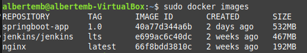
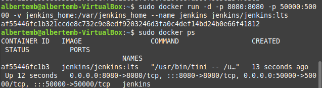
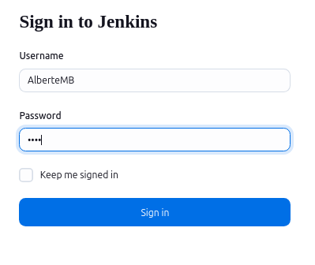
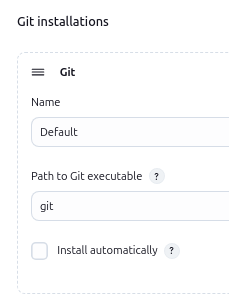
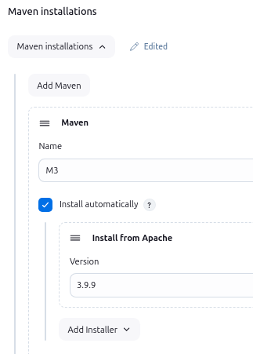
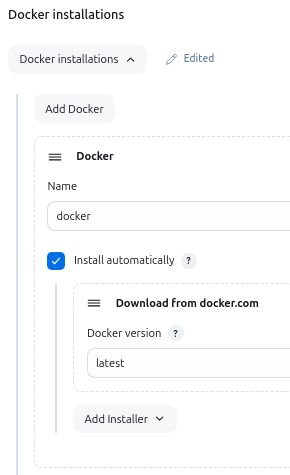
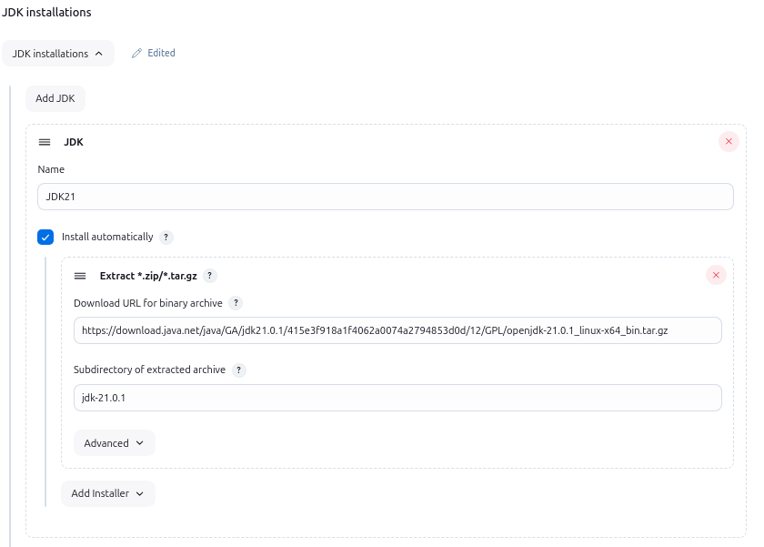
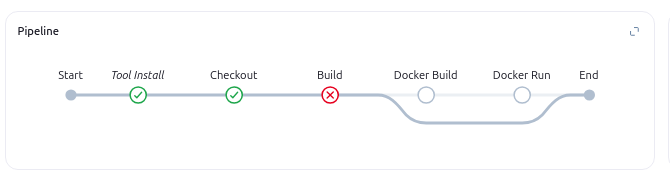
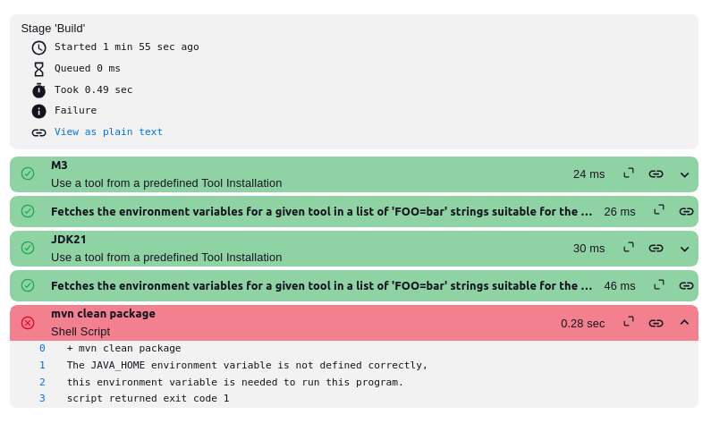
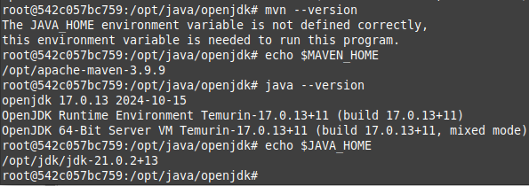

# MF05-PRA05: Jenkins CI/CD Pipeline for Spring Boot Application
## Explanation step by step

- ## Downloading the jenkins/jenkins image: 



- ## Docker with Jenkins running.



- ## Login in Jenkins



- ## Logs from Jenkins

```bash
albertemb@albertemb-VirtualBox:~$ sudo docker logs jenkins
Running from: /usr/share/jenkins/jenkins.war
webroot: /var/jenkins_home/war
2024-12-11 16:37:52.943+0000 [id=1]	INFO	winstone.Logger#logInternal: Beginning extraction from war file
2024-12-11 16:37:53.019+0000 [id=1]	WARNING	o.e.j.ee9.nested.ContextHandler#setContextPath: Empty contextPath
2024-12-11 16:37:53.061+0000 [id=1]	INFO	org.eclipse.jetty.server.Server#doStart: jetty-12.0.13; built: 2024-09-03T03:04:05.240Z; git: 816018a420329c1cacd4116799cda8c8c60a57cd; jvm 17.0.13+11
2024-12-11 16:37:53.570+0000 [id=1]	INFO	o.e.j.e.w.StandardDescriptorProcessor#visitServlet: NO JSP Support for /, did not find org.eclipse.jetty.ee9.jsp.JettyJspServlet
2024-12-11 16:37:53.625+0000 [id=1]	INFO	o.e.j.s.DefaultSessionIdManager#doStart: Session workerName=node0
2024-12-11 16:37:54.176+0000 [id=1]	INFO	hudson.WebAppMain#contextInitialized: Jenkins home directory: /var/jenkins_home found at: EnvVars.masterEnvVars.get("JENKINS_HOME")
2024-12-11 16:37:54.378+0000 [id=1]	INFO	o.e.j.s.handler.ContextHandler#doStart: Started oeje9n.ContextHandler$CoreContextHandler@75f2099{Jenkins v2.479.2,/,b=file:///var/jenkins_home/war/,a=AVAILABLE,h=oeje9n.ContextHandler$CoreContextHandler$CoreToNestedHandler@1c12f3ee{STARTED}}
2024-12-11 16:37:54.387+0000 [id=1]	INFO	o.e.j.server.AbstractConnector#doStart: Started ServerConnector@4b1abd11{HTTP/1.1, (http/1.1)}{0.0.0.0:8080}
2024-12-11 16:37:54.401+0000 [id=1]	INFO	org.eclipse.jetty.server.Server#doStart: Started oejs.Server@428640fa{STARTING}[12.0.13,sto=0] @2057ms
2024-12-11 16:37:54.402+0000 [id=24]	INFO	winstone.Logger#logInternal: Winstone Servlet Engine running: controlPort=disabled
2024-12-11 16:37:54.679+0000 [id=31]	INFO	jenkins.InitReactorRunner$1#onAttained: Started initialization
2024-12-11 16:37:55.143+0000 [id=29]	INFO	jenkins.InitReactorRunner$1#onAttained: Listed all plugins
2024-12-11 16:37:59.874+0000 [id=32]	INFO	jenkins.InitReactorRunner$1#onAttained: Prepared all plugins
2024-12-11 16:37:59.930+0000 [id=31]	INFO	jenkins.InitReactorRunner$1#onAttained: Started all plugins
2024-12-11 16:38:00.031+0000 [id=29]	INFO	jenkins.InitReactorRunner$1#onAttained: Augmented all extensions
2024-12-11 16:38:00.309+0000 [id=30]	INFO	h.p.b.g.GlobalTimeOutConfiguration#load: global timeout not set
2024-12-11 16:38:01.434+0000 [id=32]	INFO	jenkins.InitReactorRunner$1#onAttained: System config loaded
2024-12-11 16:38:01.439+0000 [id=32]	INFO	jenkins.InitReactorRunner$1#onAttained: System config adapted
2024-12-11 16:38:01.711+0000 [id=30]	INFO	jenkins.InitReactorRunner$1#onAttained: Loaded all jobs
2024-12-11 16:38:01.717+0000 [id=30]	INFO	jenkins.InitReactorRunner$1#onAttained: Configuration for all jobs updated
2024-12-11 16:38:01.742+0000 [id=46]	INFO	hudson.util.Retrier#start: Attempt #1 to do the action check updates server
2024-12-11 16:38:01.766+0000 [id=31]	INFO	jenkins.InitReactorRunner$1#onAttained: Completed initialization
2024-12-11 16:38:01.866+0000 [id=23]	INFO	hudson.lifecycle.Lifecycle#onReady: Jenkins is fully up and running
2024-12-11 16:38:06.223+0000 [id=46]	INFO	h.m.DownloadService$Downloadable#load: Obtained the updated data file for hudson.tasks.Maven.MavenInstaller
2024-12-11 16:38:06.966+0000 [id=46]	INFO	h.m.DownloadService$Downloadable#load: Obtained the updated data file for hudson.tasks.Ant.AntInstaller
2024-12-11 16:38:07.719+0000 [id=46]	INFO	h.m.DownloadService$Downloadable#load: Obtained the updated data file for hudson.plugins.gradle.GradleInstaller
2024-12-11 16:38:08.556+0000 [id=46]	INFO	h.m.DownloadService$Downloadable#load: Obtained the updated data file for hudson.plugins.sonar.MsBuildSonarQubeRunnerInstaller
2024-12-11 16:38:09.316+0000 [id=46]	INFO	h.m.DownloadService$Downloadable#load: Obtained the updated data file for hudson.plugins.sonar.SonarRunnerInstaller
2024-12-11 16:38:10.180+0000 [id=46]	INFO	h.m.DownloadService$Downloadable#load: Obtained the updated data file for hudson.tools.JDKInstaller
2024-12-11 16:38:10.188+0000 [id=46]	INFO	hudson.util.Retrier#start: Performed the action check updates server successfully at the attempt #1

```
## Installing plugins in Jenkins:

- `Recommended plugins` 
- Maven Integration
- Git
- Docker
- SSH
- SonarQube Scanner

## Installing Tools in Jenkins:

### Git


### Maven


### Docker 


### JDK 21


## Error 
- Because of Maven I cannot build in the next stage.


### Overview


### Different ways to solve the issue
- In the Jenkins's bash I installed the same versions of Maven and OpenJDK 21. 
- Tring to force the OpenJDK version in enviroment area in Groovy file.

